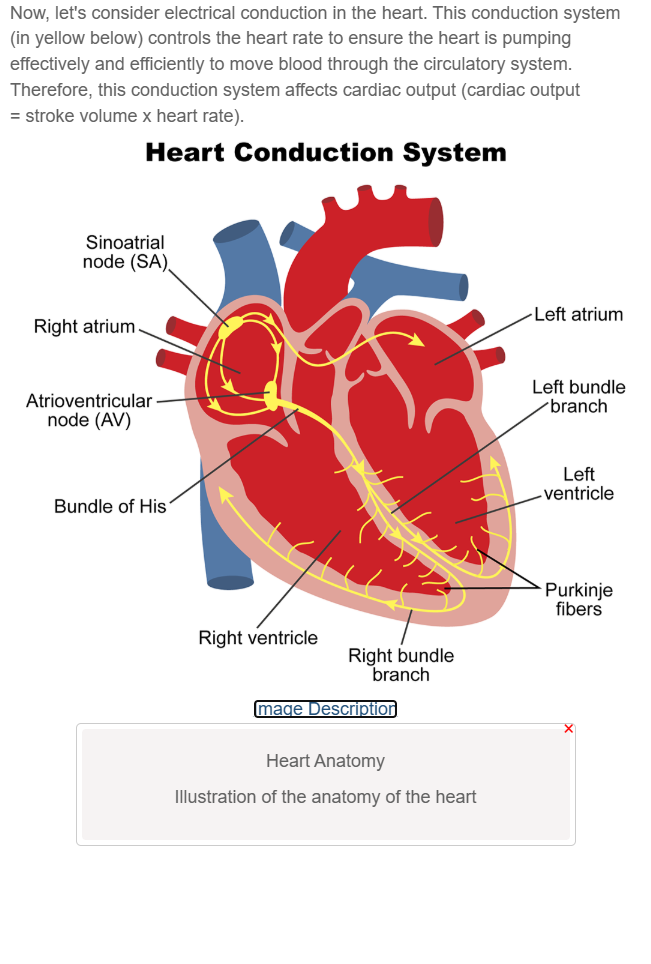

# Nursing Care: Pediatric Circulatory System Alterations

**Course:** NR328 Pediatric Nursing (Pediatric Nursing-Dennis)
**Unit:** Week 3 — Nursing Care: Pediatric Circulatory System Alterations (Unit 3)
**Module:** Nursing Care: Pediatric Circulatory System Alterations
**Status:** MASTERED (captured in review mode)
**Extracted:** 2026-07-20

## Section Manifest

1. Introduction: Pediatric Circulatory System Alterations — captured
2. Prepare: Pediatric Circulatory System Alterations — skipped
3. Explore: Cardiovascular Function in Children — captured
4. Self Check: Cardiac Pathophysiology — skipped
5. Explore: Indicators of Cardiac Dysfunction — captured
6. Self Check: Cardiac dysfunction: Assessment Data — skipped
7. Explore: Pediatric Assessment: Developmental Considerations — captured
8. Self Check: Infant Assessment — skipped
9. Self Check: Health Assessment — skipped
10. Explore: Pediatric Physical Assessment — captured
11. Self Check: Pediatric Heart Sounds — skipped
12. Reflect: Pediatric Circulatory System Alterations — skipped

---

## Section 1: Introduction: Pediatric Circulatory System Alterations

# Pediatric Circulatory System Alterations

During this learning activity, the focus will be on cardiovascular functions and alterations. The field of pediatric cardiology has experienced an evolution over the past half century. There have been advances in diagnostic techniques, procedures, and pediatric anesthesia. Consequently, the pediatric nurse is required to be more sophisticated in assessment, planning, implementation, and evaluation of care when it comes to pediatric cardiovascular pathology.

By completing these learning activities, the learner will gain the knowledge and skills needed to:

- describe hemodynamics, risk factors, clinical manifestations, and diagnostic evaluation of children with cardiovascular alterations
- conduct assessment of cardiac function when caring for children with cardiovascular alterations

---

## Section 3: Explore: Cardiovascular Function in Children

# Cardiovascular Function in Children

There are a variety of pediatric concepts and alterations to consider when learning about cardiovascular function in children. Before you explore specific alterations, let's consider the structure and function of fetal circulation and the cardiovascular system in the early stages of life. For example, as the child grows and develops, the circulatory system also grows and adapts to nutritional and oxygen requirements. Moreover, the heart, blood vessels, and lymph system also develop.

To understand the transformation from fetal circulation to normal circulation, please review the fetal circulation video. Pay particular attention to changes from fetal to normal circulation so that you can further understand congenital heart defects that result from retention of fetal circulation components.

**[NEEDS MANUAL REVIEW]** Embedded video: "Fetal Circulation Sound-1" — no transcript link available in the DOM. Watch directly in Edapt for fetal-to-normal circulation changes.

Now, let's consider electrical conduction in the heart. This conduction system (in yellow below) controls the heart rate to ensure the heart is pumping effectively and efficiently to move blood through the circulatory system. Therefore, this conduction system affects cardiac output (cardiac output = stroke volume x heart rate).

**Image Description (verbatim):** Heart Anatomy — Illustration of the anatomy of the heart

---

## Section 5: Explore: Indicators of Cardiac Dysfunction

# Indicators of Cardiac Dysfunction

In a pediatric patient, tachycardia may indicate decreased cardiac output and can be a sign of early cardiac dysfunction.

Indicators of cardiac dysfunction that may be noted during the history and physical assessment include:

- Poor feeding
- Tachypnea
- Failure to thrive, poor weight gain, or activity intolerance
- Developmental delays
- Prenatal risk factors, including substance abuse, diabetes, and maternal infection
- Family history of cardiac disease

### Remember This

The right side of the body has parts in threes. For example, the tricuspid valve is on the right side. Another example is that the right lung has three lobes. So, this is a cool fact to help you remember on which side the tricuspid valve is located.

Children have functional heart murmurs due to normal physiologic flow turbulence.

---

## Section 7: Explore: Pediatric Assessment: Developmental Considerations

# Pediatric Assessment: Developmental Considerations

Assessing children is different from assessing adults. Before you learn about specific cardiovascular alterations, here are some things to remember when assessing children with cardiac defects.

Physical assessment techniques vary depending on the age of the child. To achieve the most accurate assessment, it is recommended to follow this sequence:

### Tab: Infant

- Assess supine or sitting, preferably in caregiver's lap.
- Auscultate heart, lungs, abdomen.
  - Record respirations first, and then apical heart rate/pulse.
- Perform traumatic and invasive procedures last (i.e., blood pressure and rectal temperature).
- Infants' respirations are primarily diaphragmatic, so count the abdominal movements instead of watching for the chest movement.
- Address the child by name and explain each step to the caregiver as it is done.

### Tab: Toddler

- Assess supine, sitting, or standing near the caregiver.
- Inspect body through play (i.e., count fingers, tickle toes) using minimal contact initially.
- Introduce equipment slowly.
- Auscultate, percuss, palpate whenever quiet.
- Perform traumatic procedures last.

### Tab: Preschooler

- Assess supine, sitting, or standing with caregiver in close proximity.
- If cooperative, proceed in a head-to-toe direction.
- If uncooperative, follow toddler procedures.
- Speak to the child using developmentally-appropriate language.

### Tab: School-age

- Assess sitting; presence of caregiver based on age.
- Proceed in head-to-toe direction, examining genitalia last.
- Include the child in all parts of the assessment and speak to the caregiver before and after the examination.
- Speak to the child using developmentally-appropriate language and appeal to his or her desire for self-care.

### Tab: Adolescent

- Assess same as school-age child, offer option of caregiver's presence.
- Proceed in head-to-toe direction, examining genitalia last.
- Speak to the adolescent using mature language and appeal to his or her desire for self-care.

---

## Section 10: Explore: Pediatric Physical Assessment

# Pediatric Physical Assessment

The physical examination should include the following:

### Accordion: Growth Curve

The child's weight and height should be compared to normal values on the growth curve. Children with cardiac alterations tend to be small for their age. Many of these children fail to thrive.

### Accordion: Vital Signs

Vital signs should be assessed and may vary with age. Heart rates will decrease as the child ages. Blood pressure differences in extremities can indicate a defect known as coarctation of the aorta.

### Accordion: Heart Sounds

Auscultation of heart sounds should be completed in both a sitting and reclining position. S1 and S2 heart sounds should be clear and crisp. S1 is louder at the apex of the heart while S2 is louder near the base of the heart. Sinus arrhythmias that are associated with respirations are common.

### Accordion: Circulation

Assessing for cyanosis, capillary refill time, neck veins, edema, and clubbing of fingers should be performed. In a child with cardiovascular alterations, cyanosis will first appear as circumoral, in nailbeds, buccal, and around the eyes. Clubbing will appear only after the child has had long-term cardiac alterations resulting from long-term hypoxia.

### Accordion: Pulses

Palpation of pulses should be bilaterally equal. Pulse locations and expected findings in children and adolescents are the same as those in the adult population.

- The radial pulse is difficult to palpate accurately in children younger than 2 years of age because the blood vessels lie close to the skin surface and are easily obliterated.
- Infants and young children are often nervous or fearful, causing the heart rate to elevate; therefore, the nurse should listen to the heart a few minutes before counting the pulse.
- For infants and children, auscultate the apical pulse (4th intercostal space at the left midclavicular line) with the stethoscope for a full minute.
- In infants, brachial, temporal, and femoral pulses should be palpable, full, localized, and compared bilaterally at the same time while assessing strength and regularity.
- Pulses that are weaker in the legs and bounding in the arms can suggest coarctation of the aorta.

### Accordion: Chest

Inspection and palpation of the chest should include observing for an active precordium and palpating for heaves or thrills.

### Accordion: Lungs

Auscultation of lung sounds should be performed to listen for any fluid caused from increased pulmonary flow.

---

## Module Completion Audit

**Sections captured:** Introduction (1), Explore: Cardiovascular Function in Children (3), Explore: Indicators of Cardiac Dysfunction (5), Explore: Pediatric Assessment: Developmental Considerations (7), Explore: Pediatric Physical Assessment (10)

**Sections skipped (Prepare/Self Check/Reflect):** Prepare: Pediatric Circulatory System Alterations (2), Self Check: Cardiac Pathophysiology (4), Self Check: Cardiac dysfunction: Assessment Data (6), Self Check: Infant Assessment (8), Self Check: Health Assessment (9), Self Check: Pediatric Heart Sounds (11), Reflect: Pediatric Circulatory System Alterations (12)

**Manifest reconciliation:** 12 of 12 sections accounted for (5 captured, 7 skipped).

**[NEEDS MANUAL REVIEW]:**
- Section 3 — embedded video "Fetal Circulation Sound-1" has no transcript link; watch in Edapt for fetal-to-normal circulation changes.

**Assets:** assets/Week3_Pediatric_Circulatory_System_Alterations/03-cardiac-conduction-system.png
